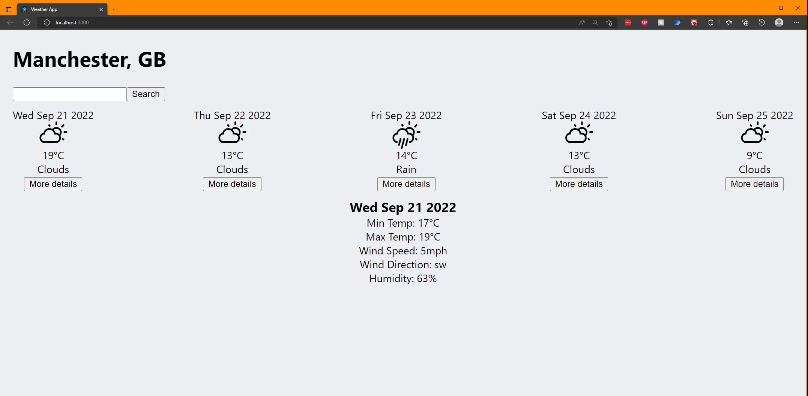
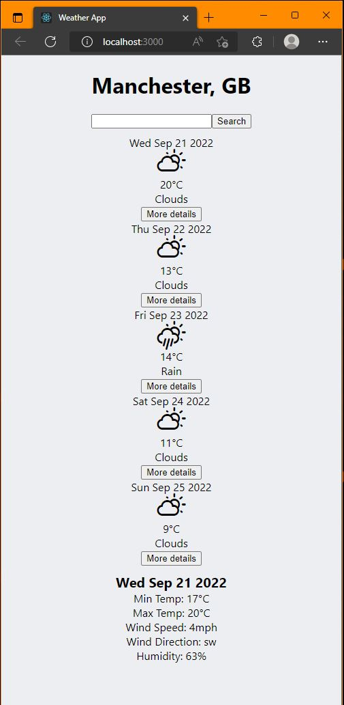

# Weather App

## About

A weather application built using React. Enter a valid city in Great Britain and you will be returned with the weather forecast for the next 5 days, you can click on each day's forecast for more detail. The weather data is fetched from the Mancester Codes Weather API.

It contains the following basic information:

- Date
- Description (Clouds, Rain, Clear, etc)
- Corresponding Icons for the description
- Temperature

For each day, you can also see more detailed information:

- Min Temp
- Max Temp
- Wind Speed
- Wind Direction
- Humidity

## Screenshots

### Desktop

### Mobile

## Technologies Used

### Language

- React (using `create-react-app`)

### Testing Utilities

- Jest
- React Testing Library

### Packages

- Axios
- PropTypes

## Installation

- Clone this repo and `cd` into it in your IDE
- Run `npm install`
- Run `npm start`

## Available Scripts

In the project directory, you can run:

### `npm start`

Runs the app in the development mode and will open [http://localhost:3000](http://localhost:3000) to view the app in your browser.

The page will reload when you make changes.

### `npm test`

Launches the test runner for the app, so you can check the current components still work if you wish to make changes.

## If I had more time

- I would have a state to change the background based on the current day's description (default)
- I would use that state to change the background, based on the description of any day selected for more details

## Author

- Will Hodgkinson
